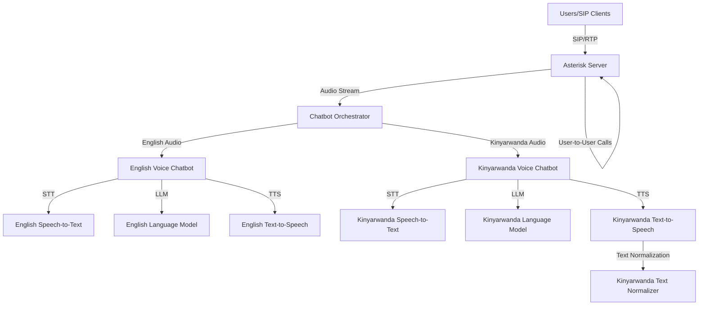

# Design Document

## Overview

The Voice Communication System is a distributed architecture that integrates Asterisk as the core telephony platform with AI-powered voice chatbots for English and Kinyarwanda languages. The system enables three primary use cases: user-to-user voice calls, English chatbot interactions, and Kinyarwanda chatbot interactions.

The architecture follows a microservices pattern where Asterisk handles telephony operations, a Chatbot Orchestrator manages the interface between Asterisk and chatbot services, and separate chatbot services handle language-specific voice processing.

## Architecture



### Component Layers

1. **Telephony Layer**: Asterisk Server handling SIP registration, call routing, and RTP audio streams
2. **Orchestration Layer**: Chatbot Orchestrator managing sessions and routing between Asterisk and chatbots
3. **Chatbot Layer**: Language-specific voice chatbot services with STT, LLM, and TTS pipelines
4. **Infrastructure Layer**: Docker containers, networking, logging, and monitoring

## Components and Interfaces

### 1. Asterisk Server

**Responsibilities:**
- Accept SIP registrations from users
- Route calls based on dial plan configuration
- Handle user-to-user voice calls directly
- Forward chatbot calls to the Orchestrator via SIP or custom protocol
- Manage RTP audio streams
- Log call detail records (CDR)

**Configuration:**
- `pjsip.conf`: SIP endpoint definitions for users and orchestrator
- `extensions.conf`: Dial plan routing logic
  - Extensions 1000-1999: User extensions
  - Extension 2000: English chatbot
  - Extension 3000: Kinyarwanda chatbot
- `rtp.conf`: RTP port ranges and codec preferences
- Codecs: ulaw, alaw, opus (prioritize opus for quality)

**Interfaces:**
- SIP/RTP with user clients (port 5060 for SIP, 10000-20000 for RTP)
- SIP/RTP or WebSocket with Chatbot Orchestrator
- AMI (Asterisk Manager Interface) for monitoring and control

### 2. Chatbot Orchestrator

**Responsibilities:**
- Accept incoming calls from Asterisk
- Maintain session state for each active call
- Route audio to appropriate chatbot service based on extension
- Handle audio format conversion (Asterisk codecs ↔ chatbot formats)
- Manage bidirectional audio streaming
- Handle chatbot service failures and fallbacks

**Technology Stack:**
- Python with asyncio for concurrent session handling
- FastAPI for REST API and WebSocket endpoints
- Redis for session state storage
- Pydantic for data validation

**Interfaces:**

*Input from Asterisk:*
- WebSocket connection per call session
- Audio format: 16-bit PCM, 8kHz or 16kHz
- Session metadata: caller ID, called extension, call ID

*Output to Chatbots:*
- gRPC or REST API calls with audio chunks
- Request format: `{"session_id": "...", "audio": "base64_encoded_pcm", "language": "en|rw"}`
- Response format: `{"session_id": "...", "audio": "base64_encoded_pcm", "text": "...", "final": bool}`

*Session Management API:*
- `POST /session/start`: Initialize new call session
- `POST /session/audio`: Send audio chunk
- `GET /session/{id}/response`: Poll for chatbot response
- `DELETE /session/{id}`: End call session

### 3. English Voice Chatbot

**Responsibilities:**
- Convert English speech to text
- Process user intent and generate responses
- Convert text responses to natural English speech
- Maintain conversation context

**Technology Stack:**
- STT: OpenAI Whisper or Google Speech-to-Text
- LLM: OpenAI GPT-4 or Claude API
- TTS: OpenAI TTS, Google TTS, or ElevenLabs
- Framework: Python with LangChain for conversation management

**Pipeline:**
1. Receive audio chunk from Orchestrator
2. Buffer audio until speech pause detected (VAD - Voice Activity Detection)
3. Send complete utterance to STT service
4. Process transcribed text through LLM with conversation history
5. Generate response text
6. Convert response to speech via TTS
7. Stream audio back to Orchestrator

**Interfaces:**
- REST API endpoint: `POST /chat/english`
- Request: `{"session_id": "...", "audio": "...", "sample_rate": 16000}`
- Response: `{"text": "...", "audio": "...", "confidence": 0.95}`

### 4. Kinyarwanda Voice Chatbot

**Responsibilities:**
- Convert Kinyarwanda speech to text
- Process user intent with Kinyarwanda language understanding
- Generate contextually appropriate Kinyarwanda responses
- Normalize Kinyarwanda text for proper pronunciation
- Convert text to natural Kinyarwanda speech

**Technology Stack:**
- STT: Custom Kinyarwanda model or Mozilla DeepSpeech fine-tuned
- LLM: Fine-tuned model on Kinyarwanda data (based on Digital Umuganda resources)
- Text Normalizer: Kinyarwanda TTS text normalizer (from references)
- TTS: Custom Kinyarwanda TTS model
- Framework: Python with custom pipeline

**Pipeline:**
1. Receive audio chunk from Orchestrator
2. Buffer audio until speech pause detected
3. Send to Kinyarwanda STT service
4. Process through Kinyarwanda LLM
5. Apply text normalization for TTS
6. Generate speech via Kinyarwanda TTS
7. Stream audio back to Orchestrator

**Interfaces:**
- REST API endpoint: `POST /chat/kinyarwanda`
- Request: `{"session_id": "...", "audio": "...", "sample_rate": 16000}`
- Response: `{"text": "...", "normalized_text": "...", "audio": "...", "confidence": 0.85}`

**Special Considerations:**
- Handle Kinyarwanda tone and morphology in text normalization
- Support code-switching between Kinyarwanda and French/English
- Implement fallback to simpler responses for low-confidence STT

## Data Models

### Call Session
```python
class CallSession:
    session_id: str
    call_id: str
    caller_id: str
    called_extension: str
    language: str  # "en" or "rw"
    start_time: datetime
    status: str  # "active", "ended", "error"
    conversation_history: List[ConversationTurn]
    audio_buffer: bytes
```

### Conversation Turn
```python
class ConversationTurn:
    timestamp: datetime
    speaker: str  # "user" or "bot"
    text: str
    audio_duration_ms: int
    confidence: float
```

### Chatbot Request
```python
class ChatbotRequest:
    session_id: str
    audio: bytes
    sample_rate: int
    language: str
    context: Optional[List[ConversationTurn]]
```

### Chatbot Response
```python
class ChatbotResponse:
    session_id: str
    text: str
    audio: bytes
    confidence: float
    final: bool  # True if conversation should end
```

## Error Handling

### Asterisk Level
- **SIP Registration Failure**: Return 403 Forbidden with retry-after header
- **Call Routing Failure**: Play error message "The number you dialed is not available"
- **RTP Timeout**: Terminate call after 30 seconds of no audio
- **Orchestrator Unavailable**: Play message "Service temporarily unavailable" and hang up

### Orchestrator Level
- **Chatbot Service Down**: Return error to Asterisk, log incident, attempt reconnection
- **Session Timeout**: Clean up session after 5 minutes of inactivity
- **Audio Format Error**: Log error, attempt format conversion, or reject call
- **Redis Connection Loss**: Use in-memory fallback, log warning

### Chatbot Level
- **STT Failure**: Return error response, prompt user to repeat
- **LLM Timeout**: Return fallback response "I'm having trouble processing that"
- **TTS Failure**: Return text-only response, log error
- **Low Confidence**: Ask clarifying question or provide multiple options

### Recovery Strategies
- Implement exponential backoff for service reconnection
- Circuit breaker pattern for chatbot services (open after 5 failures)
- Health check endpoints for all services (HTTP GET /health)
- Graceful degradation: user-to-user calls continue even if chatbots are down

## Testing Strategy

### Unit Testing
- Asterisk dial plan logic validation
- Orchestrator session management functions
- Audio format conversion utilities
- Chatbot pipeline components (STT, LLM, TTS independently)

### Integration Testing
- Asterisk to Orchestrator communication
- Orchestrator to chatbot service communication
- End-to-end audio pipeline (audio in → text → audio out)
- Session state persistence and retrieval

### System Testing
- User-to-user call establishment and quality
- English chatbot conversation flow
- Kinyarwanda chatbot conversation flow
- Concurrent call handling (10+ simultaneous calls)
- Failover and recovery scenarios

### Performance Testing
- Latency measurements (target: <200ms for user calls, <3s for chatbot responses)
- Concurrent call capacity testing
- Audio quality assessment (MOS scores)
- Resource utilization monitoring

### Test Environment
- Docker Compose setup with all services
- SIP softphone clients for testing (e.g., Linphone, Zoiper)
- Automated test scripts using PJSUA or similar SIP testing tools
- Audio sample library for STT/TTS validation

## Deployment Architecture

### Container Structure
```yaml
services:
  asterisk:
    image: asterisk:20
    ports:
      - "5060:5060/udp"
      - "10000-10100:10000-10100/udp"
    volumes:
      - ./asterisk/config:/etc/asterisk
      - ./asterisk/sounds:/var/lib/asterisk/sounds
  
  orchestrator:
    build: ./orchestrator
    ports:
      - "8000:8000"
    environment:
      - REDIS_URL=redis://redis:6379
      - ENGLISH_BOT_URL=http://english-bot:8001
      - KINYARWANDA_BOT_URL=http://kinyarwanda-bot:8002
  
  english-bot:
    build: ./chatbots/english
    ports:
      - "8001:8001"
    environment:
      - OPENAI_API_KEY=${OPENAI_API_KEY}
  
  kinyarwanda-bot:
    build: ./chatbots/kinyarwanda
    ports:
      - "8002:8002"
    volumes:
      - ./models/kinyarwanda:/models
  
  redis:
    image: redis:7-alpine
    ports:
      - "6379:6379"
```

### Network Configuration
- Internal Docker network for service communication
- Exposed ports for SIP clients to reach Asterisk
- Health check endpoints on all services
- Logging aggregation to centralized system

### Monitoring
- Prometheus metrics for call volume, latency, errors
- Grafana dashboards for real-time monitoring
- Asterisk CDR logging to database
- Application logs to ELK stack or similar

## Security Considerations

- SIP authentication for user registration
- TLS encryption for SIP signaling (SIPS)
- SRTP for encrypted audio streams
- API authentication between services (JWT tokens)
- Rate limiting on chatbot endpoints
- Input validation and sanitization
- Network segmentation between public and internal services
